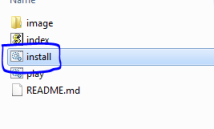
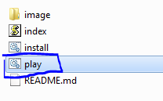
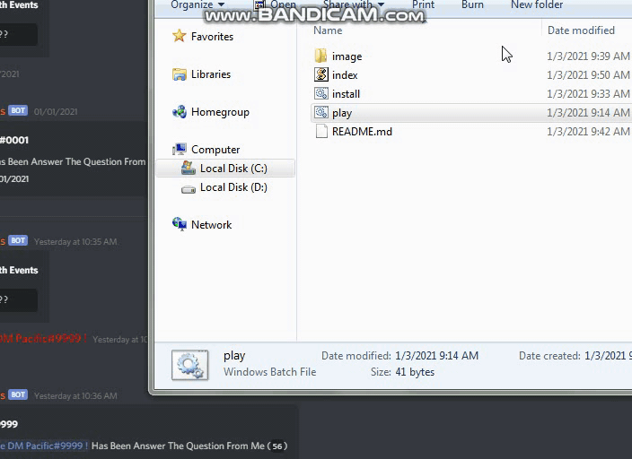

# Simple node.js ip tracker

## Package required
- axios -> **npm install axios**
- readline -> **npm install readline**

## Usage
- 1. You need to install node.js first, docs: [https://nodejs.org/en/download/](https://nodejs.org/en/download/) and then run the setup of node.js
- 2. You can also install this app program, switch `code -> download zip`, and then extract the rar to file and move it to 1 folder or your folder

- 3. click the file called `install.bat` for install the package

- 4. click the file called `play.bat` for start the program

## Picture

